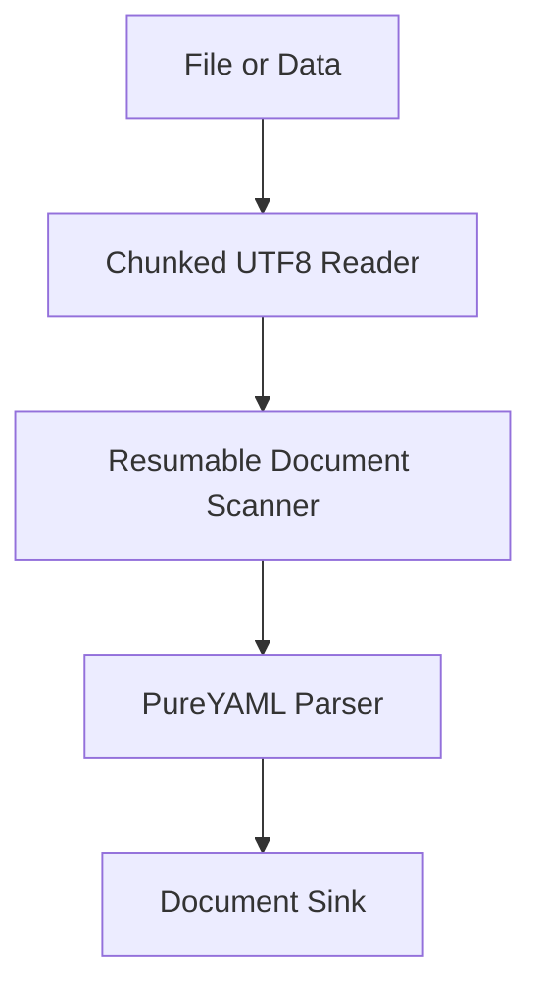
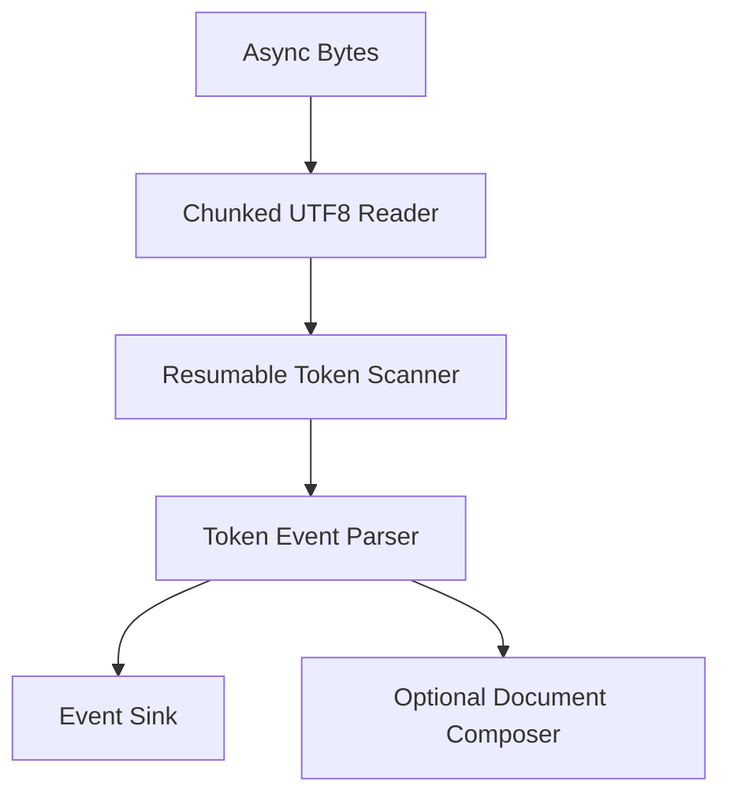

# Streaming Architecture

PureYAMLStreaming separates three concerns:

1. `ChunkedUTF8Reader` pulls bounded byte chunks from a file or data source and
   tracks byte offsets plus line and column marks.
2. `ResumableDocumentScanner` consumes chunks, detects top-level YAML document
   boundaries, and emits one document source at a time.
3. `Parser` parses each emitted document through PureYAML and hands completed
   documents to the caller.

## Why Document Streaming First

PureYAML's internal parser already avoids retaining the full token and event
arrays, but the public boundary is still a complete `String`. A fully resumable
YAML token scanner needs careful handling for quoted scalars, block scalars,
comments, indentation, CRLF, Unicode, tags, anchors, and merge keys.

Document streaming is the safe first milestone: it proves file/chunk IO,
document-at-a-time memory behavior, and API ergonomics without forking the YAML
grammar implementation.

## Future Event Streaming

The next scanner milestone should replace `ResumableDocumentScanner` with a
token-level scanner that can suspend and resume inside any YAML token. That
scanner can then feed a public event sink directly.

The intended final shape is:

